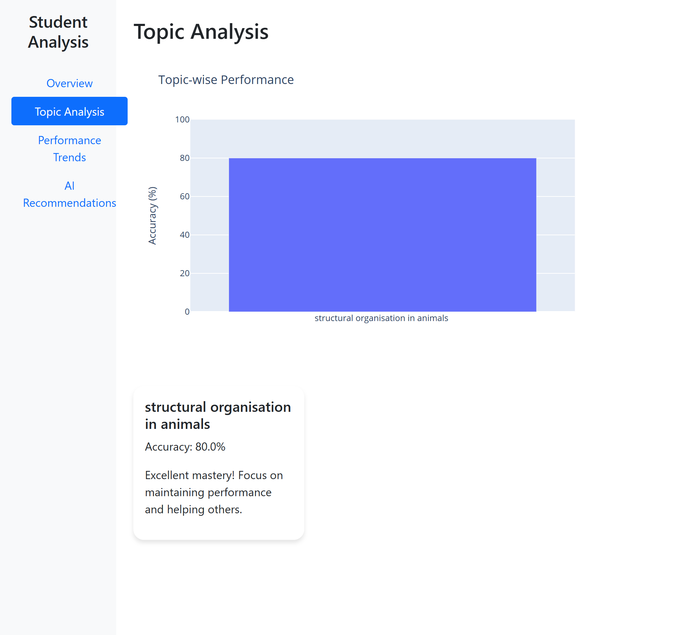
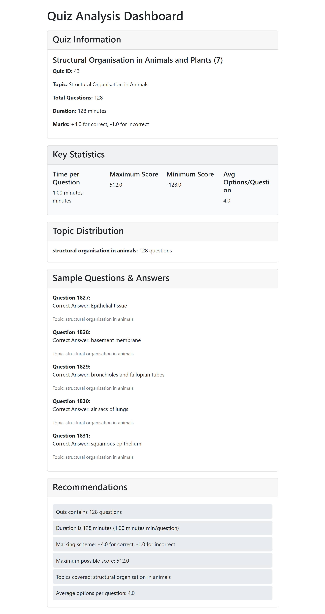
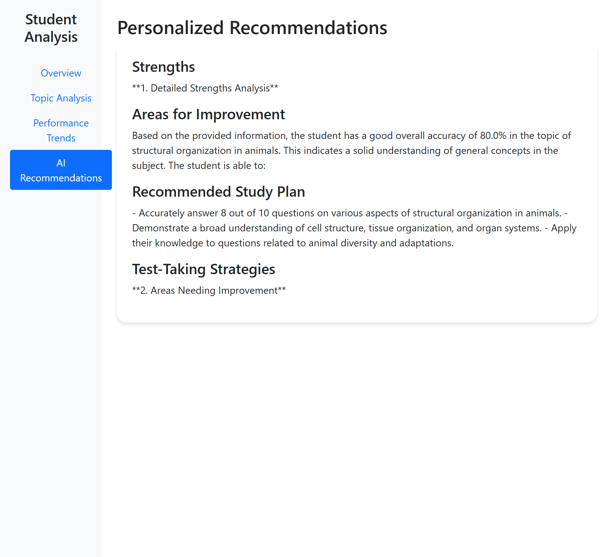

# Student-Test-Analysis

# Student Analytics Dashboard

A comprehensive analytics dashboard providing detailed insights into student performance using quiz data and AI-powered recommendations.


## 🚀 Features

- **Real-time Analytics**: Detailed analysis of student performance
- **Topic-wise Analysis**: Breakdown of performance by topics
- **Historical Trends**: Track progress over time
- **AI Recommendations**: Personalized suggestions using Google's Gemini AI
- **Interactive Visualizations**: Dynamic charts and graphs
- **Detailed Quiz Analysis**: Question-by-question breakdown with improvement tips

## 🛠️ Tech Stack

- **Backend Framework**: FastAPI
- **Frontend**: HTML, Bootstrap, JavaScript
- **Template Engine**: Jinja2
- **Data Processing**: Pandas, NumPy
- **Visualization**: Plotly
- **AI Integration**: Google Generative AI (Gemini)
- **Async Operations**: aiohttp, asyncio
- **Server**: Uvicorn

## 📁 Project Structure

```
student-analytics/
├── app/
│   ├── analytics/
│   │   └── analyzer.py        # Core analysis logic
│   ├── core/
│   │   └── state.py           # Shared state management
│   └── templates/
│       └── student/
│           └── dashboard.html # Dashboard template
├── main.py                    # FastAPI application
├── requirements.txt           # Project dependencies
└── README.md                  # Project documentation
```

## 🚀 Getting Started

### Prerequisites

- Python 3.8 or higher
- pip (Python package manager)

### Installation

1. Clone the repository:
   ```bash
   git clone https://github.com/yourusername/student-analytics.git
   cd student-analytics
   ```

2. Create and activate a virtual environment:

   - **Windows**:
     ```bash
     python -m venv venv
     venv\Scripts\activate
     ```

   - **Mac/Linux**:
     ```bash
     python3 -m venv venv
     source venv/bin/activate
     ```

3. Install dependencies:
   ```bash
   pip install -r requirements.txt
   ```

4. Set up environment variables:
   Create a `.env` file in the root directory:
   ```env
   GEMINI_API_KEY=your_google_gemini_api_key
   DATABASE_URL=your_database_url
   ```

5. Run the application:
   ```bash
   uvicorn main:app --reload
   ```

6. Access the application in your browser:
   [http://127.0.0.1:8000/student/{student_id}](http://127.0.0.1:8000/student/{student_id})
   Replace `{student_id}` with an actual student ID.

## 📊 Dashboard Sections

### 1. Overview

- Overall performance metrics
- Accuracy gauge
- Key statistics


### 2. Topic Analysis

- Topic-wise performance breakdown
- Strength and weakness identification
- Improvement recommendations



### 3. Quiz Analysis

- Question-by-question breakdown
- Correct/incorrect answers
- Detailed feedback and improvement tips


### 4. Historical Trends

- Performance over time
- Topic progress heatmap
- Trend analysis



### 5. AI Recommendations

- Personalized study plan
- Strength analysis
- Areas for improvement
- Test-taking strategies



## 🔄 Data Flow

1. User requests student dashboard.
2. System fetches data from multiple sources:
   - Quiz data
   - Student submissions
   - Historical performance
3. Analyzer processes the data:
   - Calculates performance metrics
   - Analyzes topic-wise performance
   - Generates visualizations
4. AI generates personalized recommendations.
5. Dashboard renders with all insights.

## 🛠️ Development

### Adding New Features

1. Create new analysis methods in `analyzer.py`.
2. Update the dashboard template in `dashboard.html`.
3. Add new routes in `main.py` if needed.

### Modifying Visualizations

1. Update the `_generate_visualizations` method in `analyzer.py`.
2. Add new visualization containers in `dashboard.html`.
3. Update JavaScript for new interactive features.

## 📝 API Documentation

Access the API documentation at: [http://127.0.0.1:8000/docs](http://127.0.0.1:8000/docs)

## 🤝 Contributing

1. Fork the repository.
2. Create a feature branch.
3. Commit your changes.
4. Push to the branch.
5. Create a Pull Request.

## 📄 License

This project is licensed under the MIT License - see the LICENSE file for details.

## 🙏 Acknowledgments

- Google Generative AI for providing the Gemini API
- FastAPI for the excellent web framework
- Plotly for the visualization capabilities

## 📧 Contact

For any queries or support, please contact:

- **Email**: ashoksuthar48697@gmail.com
- **GitHub**: [@yourusername](https://github.com/ashoksuthar14)

